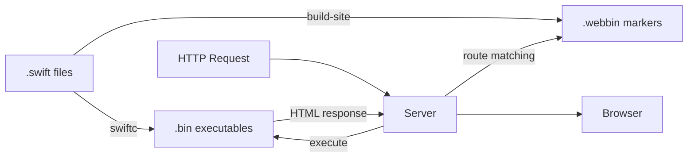
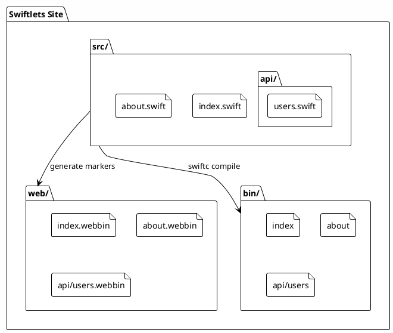

# Illustration Suggestions for Qiita Article

## 1. Architecture Overview Diagram
Replace the file structure ASCII art with a visual diagram showing:
- Three main directories (src/, web/, bin/) as colored boxes
- Arrows showing the build process flow
- Icons for different file types (.swift, .webbin, executable)

## 2. Request Flow Diagram
Visual flow chart showing:
1. Browser → HTTP Request
2. Server → Route Matching (.webbin lookup)
3. Execute Binary (with JSON input)
4. Binary → HTML Generation
5. Server → HTTP Response
6. Browser ← Rendered Page

## 3. File Mapping Visualization
Show the transformation:
- src/index.swift → web/index.webbin → bin/index
- src/api/users.swift → web/api/users.webbin → bin/api/users
Use different colors and icons for each file type

## 4. SwiftUI-style API Comparison
Side-by-side comparison:
- Left: SwiftUI code for iOS
- Right: Swiftlets code for Web
Highlight the similarities in syntax

## 5. Development Workflow Timeline
Visual timeline showing:
1. Write .swift file (code icon)
2. Run build-site (gear icon)
3. Start server (server icon)
4. Browser access (browser icon)

## Implementation Options:

### Option 1: Mermaid Diagrams (Recommended for Qiita)
Qiita supports Mermaid diagrams directly in markdown:

### Option 2: SVG Files
Create SVG illustrations and host them:
- Simple, scalable graphics
- Can be embedded directly or linked
- Tools: Figma, draw.io, or hand-coded SVG

### Option 3: PlantUML
For technical diagrams:

### Option 4: Screenshots
Include actual screenshots of:
- Running Swiftlets site
- Code editor with Swift files
- Terminal showing build process
- Browser showing the result

## Recommended Illustrations for Your Article:

1. **After "ファイルベースルーティングシステム" section**: 
   - Replace ASCII tree with a colorful directory structure diagram

2. **After "CGIライクな実行モデル" section**:
   - Add a request flow diagram showing the 4 steps visually

3. **In "仕組みの詳細" section**:
   - Add a transformation diagram showing .swift → .webbin → .bin

4. **Before "開発フロー" section**:
   - Add a workflow diagram showing the development cycle

5. **In "SwiftUIスタイルAPI" section**:
   - Add a visual comparison between SwiftUI and Swiftlets syntax

Would you like me to create specific Mermaid diagrams or SVG code for any of these illustrations?