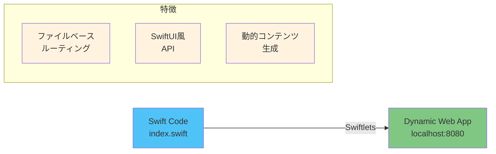
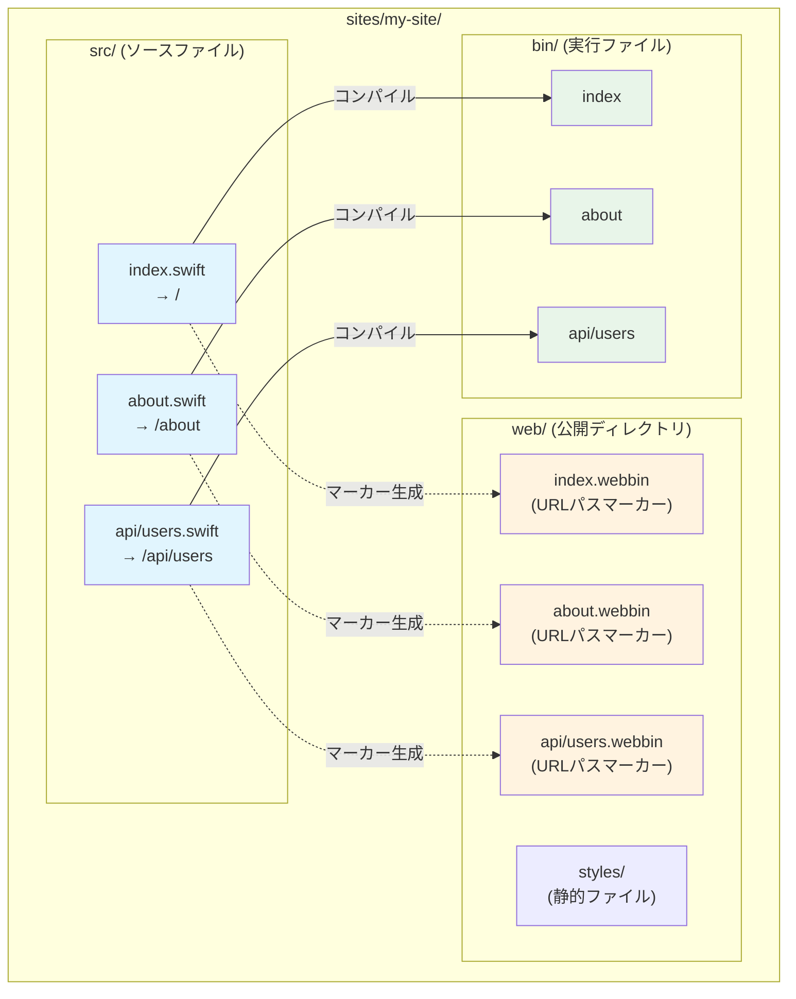
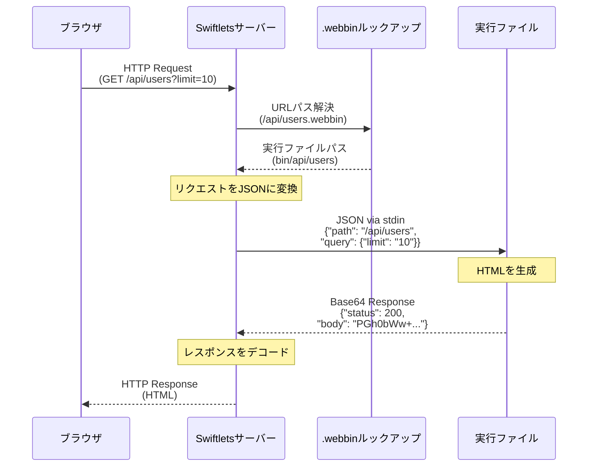
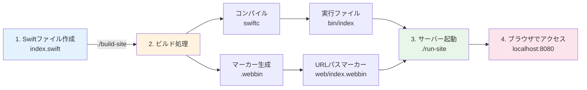
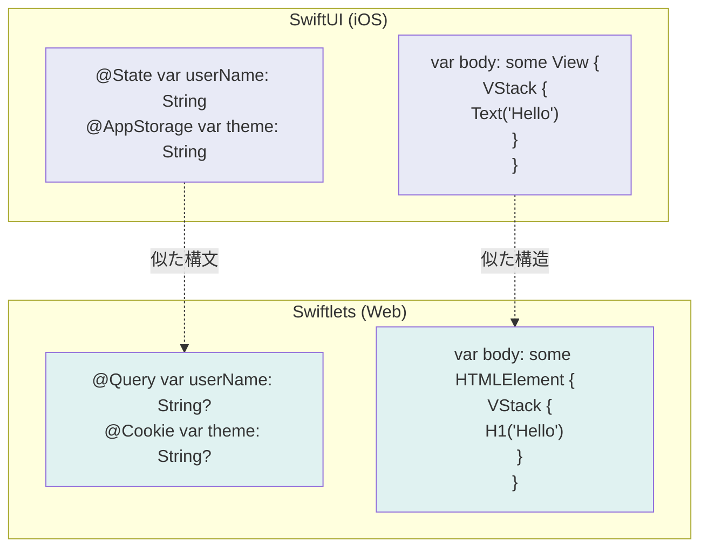

# SwiftでWebアプリケーションを開発する！Swiftletsフレームワーク入門

## 背景

Paul Hudson氏が2024年にSwiftベースでWeb開発が可能となるIgniteを発表しました。SwiftのDSL機能を利用して、SwiftのプログラムでHTMLを書く感覚のDSLで、Webサイトが構築できる画期的な内容でした。ところが、実際にIgniteでWeb開発しようとすると、一つ問題となる事があります。それは、Igniteが動的なWebサイト構築をサポートしていない点でした。これは、つまり動的なサイトが一般的な現在では、利用できないという致命的な問題でした。

私はこれをなんとか解決できないかと思案しました。とにかく、DSLでHTMLを生成するアイデアは秀逸です。これに、パラメータやクッキーなど動的にページを生成できる仕組みがあれば、この仕組みは利用できると思いました。

ここで、こんなアイデアを思いつきました。ひと昔前のWeb ServerにCGIという仕組みがありました。このような仕組みを応用して、index.htmlがindex.swiftで書く事ができ、URLのパラメーター等がindex.swiftでコンパイルされた実行可能コードに受け渡されれば、動的なサイトの構築が可能ではないかと。

さらに、Apacheのように、実際のホストディレクトリ内の`.html`に相当する実行可能コードを`.swift`で書くことができれば、面倒なルーティングも単純なディレクトリパスで実現できるというものでした。

## Swiftletsとは

Swiftletsは、Swiftで動的なWebアプリケーションを開発するための軽量フレームワークです。ファイルベースルーティングとSwiftUIライクな宣言的構文を特徴とし、各URLパスを独立した実行可能モジュール（"swiftlet"）として扱います。



### 主な特徴

- **ファイルベースルーティング**: ファイル構造がそのままURLパスになる
- **SwiftUIスタイルAPI**: `@Query`、`@Cookie`などのプロパティラッパーで簡単にデータアクセス
- **宣言的HTML DSL**: SwiftUIライクな構文でタイプセーフにHTMLを生成
- **ホットリロード**: 開発中はファイルを保存するだけで自動的にコンパイル・リロード
- **クロスプラットフォーム**: macOSとLinuxの両方に対応

## アーキテクチャ

Swiftletsのアーキテクチャは、従来のWebフレームワークとは大きく異なります。

### 1. ファイルベースルーティングシステム

> **用語について**: この記事では「ルート」という用語が混乱を避けるため、以下のように使い分けています：
> - **URLパス** (route): `/about`、`/api/users`などのWebアクセスパス
> - **ルートディレクトリ** (root): ディレクトリ構造の最上位
> - **ルーティング** (routing): URLパスとファイルのマッピング処理



### 2. CGIライクな実行モデル

各Swiftファイルは独立した実行可能ファイルにコンパイルされます。リクエストが来ると：



## 仕組みの詳細

### .swiftファイル

各`.swift`ファイルは独立したSwiftプログラムです：

```swift
import Swiftlets

@main
struct HomePage: SwiftletMain {
    @Query("name") var userName: String?
    @Cookie("theme") var theme: String?
    
    var title = "Welcome to Swiftlets!"
    
    var body: some HTMLElement {
        Html {
            Head {
                Title(title)
                Meta(name: "viewport", content: "width=device-width, initial-scale=1.0")
            }
            Body {
                Container(maxWidth: .large) {
                    H1("Hello, \(userName ?? "World")!")
                    P("Your theme preference: \(theme ?? "default")")
                }
            }
        }
    }
}
```

### .webbinファイル

`.webbin`ファイルは、そのディレクトリにURLパスが存在することを示すマーカーファイルです。これらは`build-site`スクリプトによって自動生成され、サーバーがURLパスを識別するために使用します。

例えば、`src/api/users.swift`がある場合、`web/api/users.webbin`が生成されます。

### .binファイル（実行可能ファイル）

各`.swift`ファイルは、プラットフォーム固有の実行可能ファイルにコンパイルされます：

- macOS: `bin/macos/{x86_64|arm64}/`
- Linux: `bin/linux/{x86_64|arm64}/`

これらの実行ファイルは：
- 標準入力からJSONエンコードされたリクエストを受け取る
- HTMLを生成してレスポンスを返す
- 各リクエストごとに新しいプロセスとして実行される（CGIモデル）

## 開発フロー



### 1. サイトの作成

```bash
# 新しいサイトディレクトリを作成
mkdir -p sites/my-site/src
cd sites/my-site
```

### 2. ページの作成

```swift
// src/index.swift
import Swiftlets

@main
struct IndexPage: SwiftletMain {
    var body: some HTMLElement {
        VStack(spacing: 20) {
            H1("My First Swiftlets App")
            P("Building dynamic web apps with Swift!")
        }
    }
}
```

### 3. ビルドと実行

```bash
# サイトをビルド
./build-site sites/my-site

# サーバーを起動
./run-site sites/my-site

# ブラウザで http://localhost:8080 にアクセス
```

## SwiftUIスタイルAPI

Swiftletsの最新バージョンでは、SwiftUIにインスパイアされたAPIを採用しています：



### プロパティラッパー

```swift
@Query("search") var searchTerm: String?      // URLパラメータ
@FormValue("email") var email: String?        // フォームデータ
@Cookie("session") var sessionId: String?     // クッキー
@JSONBody<User>() var userData: User?         // JSONボディ
@Environment(\.request) var request: Request  // リクエスト情報
```

### レスポンスビルダー

```swift
var body: ResponseBuilder {
    ResponseWith {
        // HTML content
    }
    .status(200)
    .cookie("session", value: newSessionId)
    .header("X-Custom-Header", value: "value")
}
```

## まとめ

Swiftletsは、Swiftの強力な型システムとDSL機能を活用して、動的なWebアプリケーションを構築するための新しいアプローチを提供します。ファイルベースルーティングとCGIライクな実行モデルにより、シンプルで理解しやすいアーキテクチャを実現しています。

SwiftUIの経験があれば、すぐに使い始めることができ、iOSアプリ開発で培ったスキルをWebアプリケーション開発に活かすことができます。

## リンク

- [GitHub リポジトリ](https://github.com/codelynx/swiftlets)
- [ドキュメント](https://github.com/codelynx/swiftlets/tree/main/docs)
- [サンプルサイト](https://github.com/codelynx/swiftlets/tree/main/sites/swiftlets-site)

